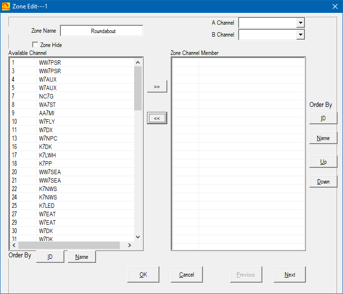

In order to make the contesting life a little easier, we provide some files you can use to program your radios. **The Channel number in each file corresponds to the repeater's "Repeater Roundabout Number" (RR#) which you need to log in the contest.**

These files are automatically generated each time a new repeater is added. Many thanks to [Mike K7MCK](https://www.qrz.com/db/k7mck) for contributing code to generate the AnyTone D878 and Icom IC-705 files.

| Download | Type | FM | DMR | DSTAR | Fusion |
|:--------:|:-----|:--:|:---:|:-----:|:------:|
|  | [Chirp](https://chirp.danplanet.com/projects/chirp/wiki/Home) |  | | |  |
|  | [AnyTone AT-D878](https://support.bridgecomsystems.com/anytone-878-v2-model-cps-firmware-downloads) |  |  | | |
|  | [Icom IC-705](https://www.icomjapan.com/support/firmware_driver/3067/) |  | |  | |
|  | All repeaters |  |  |  |  |

 

## Chirp help

[Chirp](https://chirp.danplanet.com/projects/chirp/wiki/Home) is a free, open-source tool for
programming a large number of radios.

1. You'll want to check that Chirp [supports your
   radio](https://chirp.danplanet.com/projects/chirp/wiki/Supported_Radios). 
2. You will need a programming cable that works with your radio. Chirp has [a
   guide on the
   subject](https://chirp.danplanet.com/projects/chirp/wiki/CableGuide), and
   Dave Casler KE0OG has [a video on the
   subject](https://www.youtube.com/watch?v=nzkFVtyttKM) for some of the common
   Chinese radios.
3. [Install Chirp](https://chirp.danplanet.com/projects/chirp/wiki/Download) on your computer.
4. You are now ready to test [cloning from your
   radio](https://chirp.danplanet.com/projects/chirp/wiki/Beginners_Guide). If
   this works, your radio and computer are correctly communicating, and you are
   ready to write our <a href="assets/programming_files/rr_frequencies.csv"
   download>CSV file</a>. Dave Casler has [a good video to get you
   started](https://www.youtube.com/watch?v=Mrpqq-xi00g).

For more information, check out [Chirp's Wiki](https://chirp.danplanet.com/projects/chirp/wiki/Home).

## AnyTone D878 instructions

Our <a href="assets/programming_files/d878.zip" download>download for the
D878</a> is a zip file containing three files :
- `d878.csv` contains all of the repeater information (frequencies, offsets, tones)
- `d878-talk-groups.csv` contains a set of talk group definitions for the DMR
  repeaters
- `d878-scanlist.csv` contains information that allows you to scan across all repeaters in the
  Roundabout

Run the [CPS
software](https://support.bridgecomsystems.com/anytone-878-v2-model-cps-firmware-downloads):

1. Select the `Tools > Import` menu and select each of the files you've downloaded in the
   appropriate category (Channel, Scan List, and/or Talk Groups).
2. Add all the channels to a Zone:
    Click on the Zone in the side-panel
    Double click the No. 1 Zone row - you should see this Zone dialog:

   

   Select all the channels by selecting the first channel and then SHIFT-selecting the last channel.
    Press the `>>` button to copy all the channels to the zone.
    You can also enter "Roundabout" as the Zone Name (optional).
3. Then use the `Program > Write to Radio` menu to send the program to your D878.

## Icom IC-705 instructions

*These have been tested with the Icom-705.  If you have an Icom 7300 (or other Icom radio), please
let us know if this file is also compatible with your radio.*

1. Download and install the [Icom CS-705
   Software](https://www.icomjapan.com/support/firmware_driver/3067/).
2. Connect a USB cable from your computer to the Icom 705.
3. Use the `COM Port > Setting...` command to select the COM port used by the USB connection.
4. Use the `Clone > Read <- TR` menu to duplicate the Icom's settings to your computer.
5. Click on `Memory CH > <<Add Group>>` to create a new group of memory channels for the
   repeater roundup channels.
6. Select the new group and use the `File > Import > Group` menu and select the
   downloaded <a href="asserts/programming_files/icom.csv" download>icom.csv</a>file.

## All repeaters

<a href="assets/programming_files/all_rr_frequencies.csv" download>This file</a> contains frequencies for all repeaters, not formatted for any particular program. You should be able to modify it for your radio of choice.